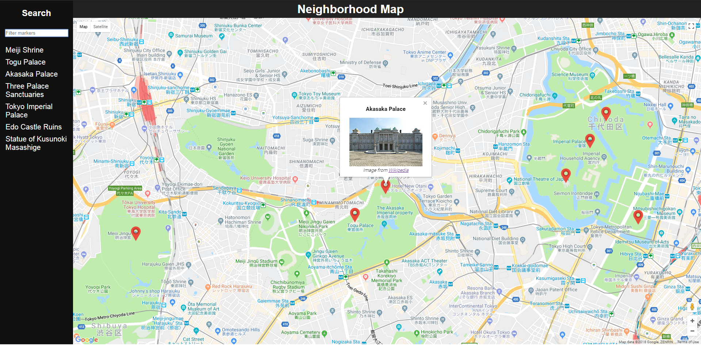

# Project: Neighborhood map
Project created for Google Developer Challenge Scholarship: Front-End Web Developer Nanodegree Program 2018.

## Description

Neighborhood map is an web-application based on React framework, created with: ```npx create-react-app``` command.  
Project includes [Google Maps API](https://cloud.google.com/maps-platform/) and [Wikipedia API](https://www.mediawiki.org/wiki/API:Main_page).


## Installation
Clone project or download project zip. Navigate into the project folder and run:
```
npm install
```
This will install all required dependencies.  
In order to start application run following command in your terminal:
```
npm start
```

Project includes default Service Worker implementation provided via  ```npx create-react-app``` command.  
In order for it to work project needs to be run in production mode. To do that execute following commands in given order:  
```
npm run build

npm install -g serve

serve -s build
```

## Usage
Several predefined location markers are displayed on map. User can filter them using provided search box in side navigation panel. 
After clicking on search list link or marker itself additional information is displayed above marker.

## Google Maps API key
Api key provided in this project has access limitation, feel free to swap it with your own. To do that navigate to ```MapContainer.js``` and paste your api key into:
```
export default GoogleApiWrapper({
  apiKey: ('YOUR_API_KEY')
})(MapContainer)
```